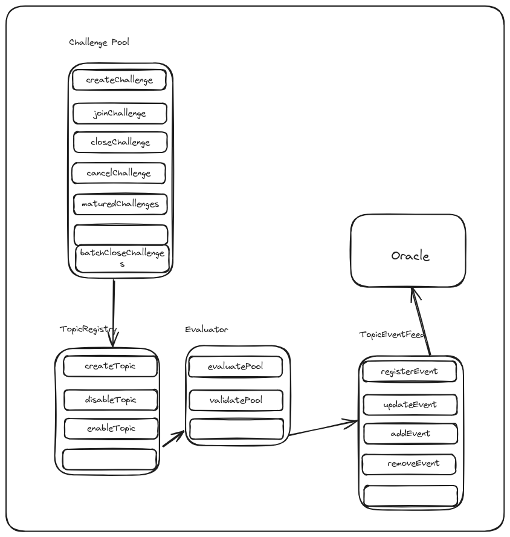

## Soccersm Challenge Pool Specification

### What is a Challenge Pool?

- A decentralized contract that allows non-trusting parties to challenge each other on the outcome of a future event.
- Each party must commit a stake to the pool to back their predicted outcome.
- In Soccersm the amount to commit is fixed and determined by the party that initializes the pool.
- When the pool matures, that is, after the actual outcome of the predicted event is determined. The pool will automatically determine the winners and loosers based on their pre-selected predictions to the outcome of the event in question.
- Since all this is handled on the blockchain by a smart contract, it is truly decentralized, trustless and non-censoring approach to betting.
- The future event could be on any topic ranging from sports to politics to personal events in the life of celebrities.

### How does it work?

A wierd diagram of the core smart contract systems.

The core of challenge pools is powered by a collections of contracts, oracles and smart contract automation systems.

#### Entities

##### Event

- An event is an occurrence for which the outcome is of interest to different parties who may want to predict the outcome.
- For example a football match between Dortmund & Real Madrid or the price of Bitcoin at a future date.

##### Topic

- A topic is a subject matter for which events can occur.
- For example the price of a given asset.
- The outcome of a football match.
- The outcome of a game.

##### Challenge

- A challenge is a collection of prediction events and a choice to make whether these predictions will happen or not.
- A challenge has muliple events each with prediction and allows players to choose a yes or no on whether all of these collection of events will occur.

#### ChallengePool Contract

- This contract keeps tracks of the state of challenges that users have engaged in, their stakes, predictions and actual outcomes.
- It handles the openning and closing of pools, or updating to appropriate state as and when needed.
- It keeps track of user rewards and winnings.

##### Methods

- `createChallenge`
- `joinChallenge`
- `closeChallenge`
- `batchCloseChallenges`
- `cancelChallenge`
- `withdrawWinnings`

#### TopicsRegistry Contract

- This contract keeps track of various pool topics, whether they are active or not.
- For example there are going to be following pool topics for the start
  - Football
    - Over/Under
    - Outcome
    - Correct Score
  - Asset Price
    - Higher Than Target
    - Lower Thank Target
    - Ends Between
    - Ends Outside

##### Methods

- `createTopic`
- `disableTopic`
- `enableTopic`

#### Evaluator Contract

- Each pool topic has its own evaluator which is able to take a prediction and determine the outcome.
- It is able to validate the input of a pool topic.
- Evalutor contracts rely on `TopicEventFeed` to determine the external state of the world.

##### Methods

- `evaluatePool`
- `validatePool`

#### TopicEventFeed Contract

- This contract keeps track of real world events.
- It provide event feed for a particular topic.
- Evaluator contracts rely on this contract for real world information.
- This contract in turn relies on oracles or could act directly as oracle.
- It also handles registration of events. For example adding upcoming football matches. Only events registered on this contract can be predicted on.
- Allows for manual event updates in case of automation failure.

#####

- `registerEvent`
- `updateEvent`
- `addEvent`
- `removeEvent`

## Application Flows

### Create Challenge Flow

- Validate event params for each event.
- Deduct user stake
- Deduct pool fee
- Recored new challenge

### Join Challenge Flow

- Validate if pool maximum has not been reached. Pool maximum is the number of players that are allowed to join a pool.
- Deduct user stake
- Deduct pool fee
- Add user to challenge

### Close Challenge Flow

- Validate if pool is matured.
- Evaluate each event and set actual outcome
- 

### Cancel Challenge Flow

- Validate if pool is stale.
- Set pool state to cancelled.

### Handling Stale Challenges

- A challenge becomes stale if an evaluator fails to evaluate an event.
- When this happens there are two options, to allow for a manual evaluation of the pool or to cancel the pool.
- The best outcome is to be able to successfully close all pools, however cancelling a pool might be necessary once in a while.

## Challenge Pool States

- Challenge Pools have several states they can assume based on how things play out.

### Open State

- The initial state of every pool is open.
- In open state anyone can join a pool.

### Locked State

- After some time a pool becomes locked.
- Locked state prevents new participants from joining.
- This state occurs automatically based on time to maturity.

### Mature State

- A pool enters mature state when the maturity time is up.
- This state occurs automatically by comparing current block time to maturity time.

### Closed State

- A pool enters closed state after `closeChallenge` is successfully called.
- After closed state players can withdraw their profit in case of win.

### Stale State

- A pool becomes stale if an evaluator fails to provide result for an event.
- If pool evaluation fails, it can be retried 3 times in exponetial time intervals.
- If after the 3 trials the pool fails to evaluate, it will be moved to Manual.

### Manual State

- A pool in manual state allows an admin account to decide the actual outcome of the pool. This account can be a DAO controlled account which allows multiple witnesses to attest the real world to the smart contract.
- From this state it can also be decided to cancel the pool

### Cancelled State

- A pool in cancelled state has no winners or loosers.
- All participants are able to withdraw their stake.

## Soccersm Wheel Specification

### What is Wheel?

- It is a smart contract powered game in the soccersm ecosystem.
- Similar to spin the wheel.

### How it works.

- User stakes an Trophies to spin the wheel.
- Soccersm platform sends the results of the action to the smart contract.
- Trophies won are transferred immediately.

### Entities

#### Spin

- Represents a play initialization.
- A spin is initialized by one user.

## Soccersm Raffle Specification

### What is Raffle?

- A smart contract game that allows players to stake fixed amounts during an open period.
- After the open period a few of the players are randomly picked using a random oracle
- The entire pool is distributed amongst them.

### How it works.

- Players stake a fixed amount during an open period.
- An oracle randomly submits a seed which is used to pick winners.
- Entire stake is split amongst winners.
- This is a repeating hourly cylcles called epochs.

### Entities

#### Raffle

- Represents pool for each epoch of the raffle.
- There can only be one `Raffle` at a time.

#### Methods
- `createRaffle`
- `joinRaffle`
- `withdrawWinnings`